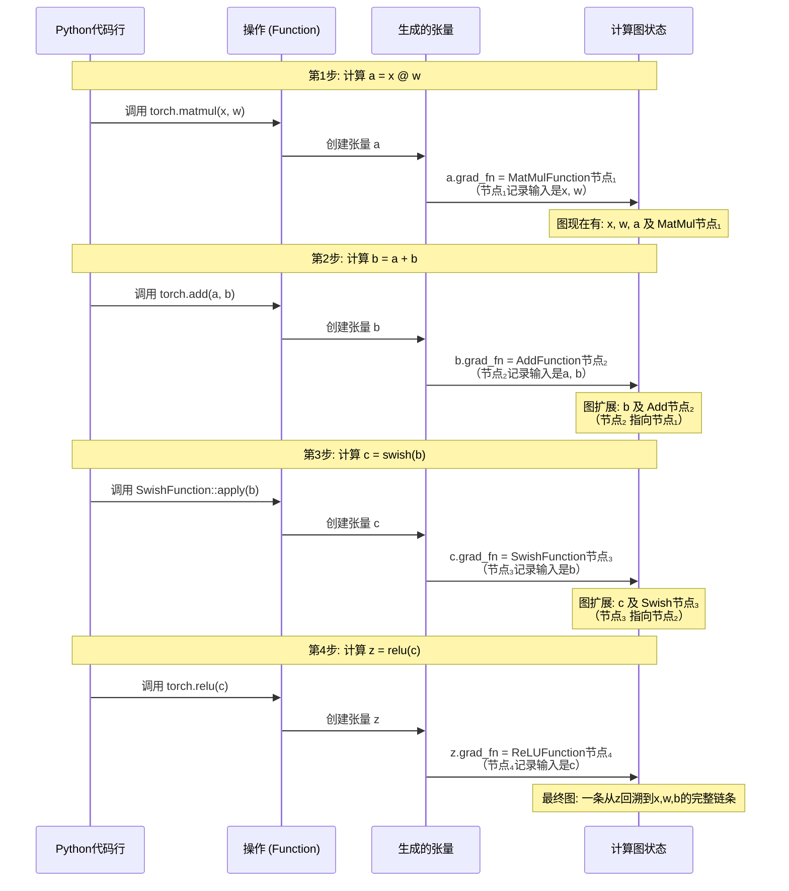

非常好，这是理解PyTorch动态性的关键。我们来彻底讲清楚。

### 🎯 核心概念：什么是计算图？

计算图是一种数据结构，它用**有向图**的形式记录一次计算过程中所有参与运算的**数据（张量）** 和**操作（Function）** 之间的依赖关系。在PyTorch中，它是**在代码运行时动态创建**的。

对于你的Swish例子：`y = swish(x)`，当`x.requires_grad=True`时，最终形成的**计算图节点与依赖关系**可以通过下图直观展示：

上图展示了一次前向传播后形成的最小计算图。这里有几个关键点：

1. **叶子张量**：`x`是用户直接创建的，它的`.grad_fn`为`None`，`.is_leaf`为`True`。它是梯度计算的起点。
2. **非叶子张量**：`y`是由Swish操作产生的，它的`.grad_fn`属性**指向了创建它的那个`SwishFunction`节点实例**。这是图中最重要的指针，它将张量和操作连接起来。
3. **操作节点**：`SwishFunction`节点内部保存了计算所需的上下文（如输入值`x`）和计算规则（前向公式和反向公式）。

### 🔄 计算图是如何“动态”构建的？

“动态”意味着图是在Python解释器执行你的代码时，**一行一行实时构建出来的**，而不是事先定义好的静态结构。

让我们模拟一个更复杂的例子：`z = torch.relu(swish(x @ w + b))`，并跟踪计算图的构建过程。

**动态性的核心体现**：

1. **条件分支**：如果你的代码有`if`语句，比如 `y = swish(x) if x.sum() > 0 else -swish(x)`，那么**每次运行时根据`x`的值不同，构建出的计算图结构也会不同**（可能走then分支，可能走else分支）。这是静态图框架（如TensorFlow 1.x）难以做到的。
2. **循环**：`for`循环中的操作会在图中创建**多个串联的节点**。循环迭代10次，图中就可能会有10个相似的节点序列。

### ⚙️ 计算图如何驱动反向传播？

当你在最终输出`z`上调用`z.backward()`时，Autograd引擎会**沿着`.grad_fn`指针形成的这条链，从后往前（反向）执行以下流程**：

**要点**：

- **链式法则的自动化**：每个`Function`节点只负责计算**本地梯度**（如Swish节点计算 `∂c/∂b`）。它接收“后辈”传来的梯度（`∂loss/∂c`），将其与本地梯度相乘，得到传递给“前辈”的梯度（`∂loss/∂b = (∂loss/∂c) * (∂c/∂b)`）。这就是自动微分。
- **梯度累积**：梯度最终被累积到**叶子张量**的`.grad`属性中（如`x.grad`， `w.grad`）。如果是多次`backward`（如在RNN中），梯度会累加。

### 💎 总结：为什么你要深刻理解计算图？

对于你（AI系统研发者）来说，理解计算图意味着：

1. **调试能力**：当梯度出现`NaN`或不更新时，你可以通过检查 `.grad_fn` 链来定位问题出在哪一层。
2. **高级优化**：理解图的结构，才能进行**梯度检查点**（用时间换内存）、**自定义自动微分规则**等高级操作。
3. **系统设计**：当你设计自己的`SwishFunction`时，你清楚地知道：**我创造的不仅仅是一个函数，而是一个未来将被嵌入动态图、参与全局梯度传播的“一等公民”**。你会明白`ctx.save_for_backward`存下的数据，就是未来反向传播时这个节点的“记忆”。

**最终认知**：在PyTorch中，**执行前向传播代码的过程，就是构建计算图的过程**。图是执行的副产品，而这个副产品正是自动微分得以实现的基础。你的`SwishFunction`是这张网中的一个可自定义的节点。
