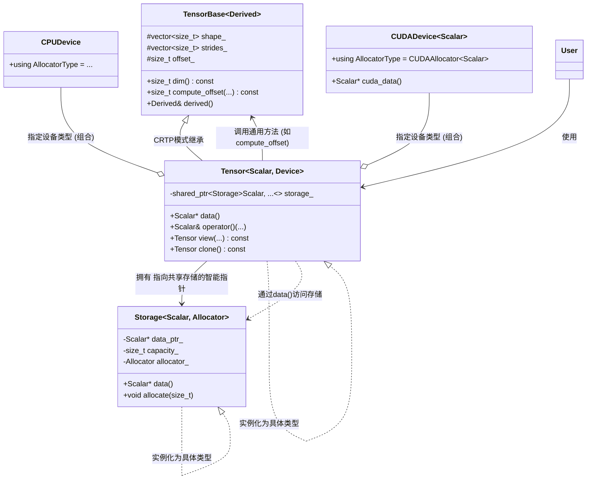
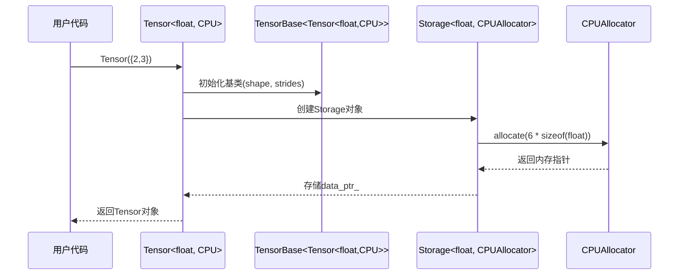
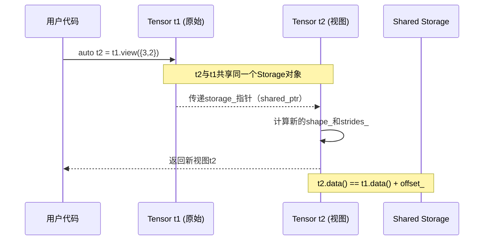
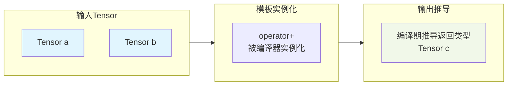

下图清晰地展示了基于模板的Tensor库核心架构中，各关键组件之间的关系与数据流向：



### 📊 核心关系与数据流解释

**1. 垂直继承关系（CRTP模式）：**

- **`Tensor` 继承自 `TensorBase<Tensor<...>>`**：这是一种奇特的递归模式。`TensorBase` 的模板参数就是其派生类 `Tensor` 自身。这使得 `TensorBase` 在编译时就知道派生类的确切类型，可以通过 `derived()` 方法安全地进行静态转换，**实现静态多态而无虚函数开销**。
- **作用**：所有Tensor变体（如 `Tensor<float, CPU>` 和 `Tensor<double, GPU>`）共享 `TensorBase` 中的通用算法（如 `compute_offset`）和视图参数（`shape_`, `strides_`, `offset_`）。

**2. 水平组合关系（所有权与策略）：**

- **`Tensor` 持有 `shared_ptr<Storage<...>>`**：这是**共享所有权的核心**。多个Tensor对象可以持有指向同一个 `Storage` 的智能指针，实现数据共享。`Storage` 是实际管理内存（`data_ptr_`）的生命周期和分配策略（`allocator_`）的类。
- **`Device` 作为模板参数**：`Tensor<Scalar, Device>` 中的 `Device`（如 `CPUDevice` 或 `CUDADevice<Scalar>`）是一个策略类，它决定了 `Storage` 使用何种 `Allocator`，从而决定了内存分配在CPU还是GPU上。这是一种**策略模式**的编译期实现。

**3. 实例化与类型生成（编译期展开）：**

- 当用户代码声明 `Tensor<float, CPUDevice> A;` 时，编译器会：
  1. 根据 `CPUDevice` 找到对应的 `Allocator` 类型。
  2. 实例化出具体的 `Storage<float, CPUAllocator>` 类。
  3. 实例化出具体的 `Tensor<float, CPUDevice>` 类，它继承自 `TensorBase<Tensor<float, CPUDevice>>`。
- 最终生成的是两份完全独立、类型安全的二进制代码：一份处理 `float` 在CPU上，另一份处理 `double` 在GPU上。它们之间没有运行时判断，所有调用都是直接绑定。

**4. 典型数据流（以创建视图和访问为例）：**

```plaintext
用户调用 `auto view = original.view({新形状});`
1. `original.view()` 方法内部创建一个新的 Tensor 对象 `view`。
2. `view` 通过拷贝构造函数，**复制了 `original.storage_` 智能指针**（增加引用计数，共享数据）。
3. `view` 设置自己的 `shape_` 和 `strides_`，但 `offset_` 通常与 `original` 相同。
4. 当用户访问 `view(i, j)` 时：
   a. 调用从 `TensorBase` 继承的 `compute_offset(i, j)`，基于 `view` 自己的 `strides_` 和 `offset_` 计算线性地址。
   b. 通过 `view.data()` 获取指向共享 `Storage` 的指针，并加上计算出的偏移量。
   c. 返回正确位置的 `Scalar` 引用。

整个过程没有数据拷贝，只有元数据的复制和指针共享。
```

这张图和解释展示了你的设计如何将 **“零开销抽象”** 和 **“编译期多态”** 的理念贯穿始终。它清晰地传达给评审者：你不仅实现了一个功能，更构建了一个具有工业级设计思想的系统原型。
🔄 核心关系与调用流程详解

### 1. **所有权关系（实心菱形）**

* **`Tensor` 组合 `Storage`**：每个 `Tensor` 对象持有一个 `shared_ptr<Storage>`，这是**共享所有权的核心**。

* **关键点**：当创建视图（如`reshape`）时，新 `Tensor` 对象复制这个 `shared_ptr`，从而共享同一 `Storage` 数据。

### 2. **编译期多态关系（空心三角箭头）**

* **`Tensor` 继承 `TensorBase<Tensor<...>>`**：这是 **CRTP（奇异递归模板模式）**。

* **工作原理**：`TensorBase` 的模板参数是它自己的派生类（`Derived = Tensor<float, CPU>`）。通过 `derived()` 方法，基类可以**在编译期**转换为具体的派生类，调用其方法。

* **优势**：实现了类似虚函数的多态接口，但**无运行时虚表查找开销**。

### 3. **策略注入关系（虚线箭头）**

* **设备策略**：`Tensor` 模板接收 `Device` 类型参数（如 `CPUDevice`, `CUDADevice<float>`）。这决定了内存分配和计算发生在哪里。

* **分配器策略**：`Storage` 模板接收 `Allocator` 类型参数。`Device` 类型会定义自己对应的 `AllocatorType`（如 `CUDADevice::AllocatorType = CUDAAllocator<float>`）。

* **优势**：行为通过模板参数“注入”，而非运行时判断。编译器能为每种组合生成最优代码。

## 🔄 关键交互流程解析

### **1. 对象创建流程**



### **2. 视图操作流程 (零拷贝)**



### **3. 运算类型推导流程**



## 💎 设计精华总结

1. **类型安全塔**：从用户层`Tensor<Scalar,Device>`到底层`Storage<Scalar,Allocator>`，**类型信息`Scalar`像DNA一样贯穿始终**，确保任何类型违规在编译期就被捕获。

2. **零开销抽象**：
   
   - **CRTP静态多态**：无虚函数表开销，所有方法调用在编译期解析和內联。
   - **视图零拷贝**：多个Tensor对象通过`shared_ptr`共享同一份`Storage`数据，仅视图参数不同。

3. **清晰的关注点分离**：
   
   - `TensorBase`：通用算法（索引计算、形状操作）
   - `Tensor`：类型/设备特定的接口
   - `Storage`：数据生命周期管理
   - `Allocator`：设备特定的内存分配策略

4. **编译期多态**：通过`TensorBase<Derived>`的CRTP模式，**在编译期实现了“继承+多态”的效果，但无运行时开销**。`TensorBase`通过`static_cast<Derived*>(this)`调用具体子类的方法。

这个设计的美妙之处在于：**它既提供了高级的、灵活的抽象（支持任意数据类型、设备、视图操作），又通过C++模板机制，在编译期将这些抽象全部“溶解”为针对具体类型的高效代码**。这正是高性能AI系统所追求的“零开销抽象”哲学。
